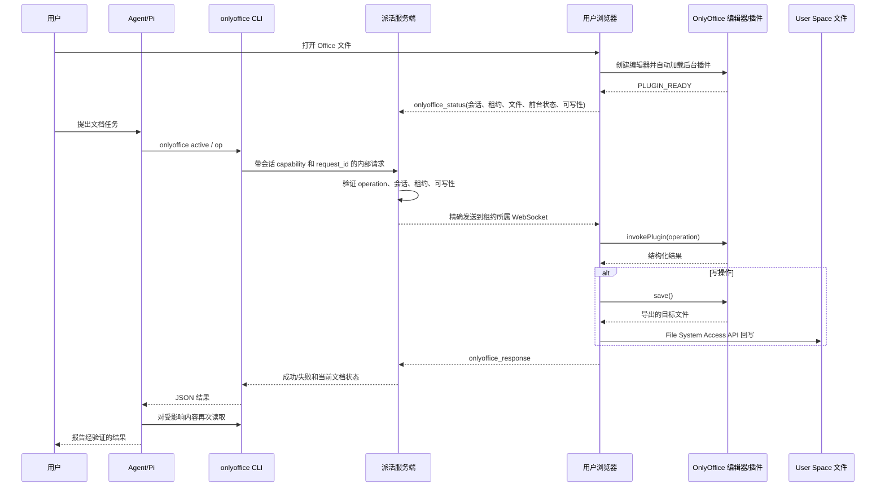

# OnlyOffice Agent浏览器桥接：逆向产品文档

> 文档性质：根据当前分支相对 `main` 的实现与测试逆向整理，不是先验需求文档。
>
> 逆向基线：2026-07-22 的 `main`；实现分支：`toy/feat/onlyoffice-browser-plugin-bridge`。
>
> 更新时间：2026-07-22。

> 分阶段能力扩展待办见：[OnlyOffice Agent能力 Backlog](./onlyoffice-agent-bridge-backlog.md)。

## 1. 一页结论

该分支在 `main` 已有的“用户在浏览器中手动预览、编辑和保存 Office 文件”能力之上，增加了一条“Agent通过当前用户的浏览器直接读取和编辑 Office 文件”的本地桥接链路。

核心产品承诺可以概括为：

- 文件继续留在浏览器授权的 User Space，不自动上传到服务端或第三方 Office 服务。
- 原生 Pi 会话通过受限的 `onlyoffice` CLI 发起结构化操作，不直接获得浏览器文件句柄或宿主机路径。
- 服务端将操作限定在同一用户运行时、同一会话和一个明确的浏览器连接/编辑器租约内。
- Word 写操作默认开启修订；Excel 和 PowerPoint 写操作直接落盘。
- 每次写操作在返回成功前触发 OnlyOffice 导出和浏览器 File System Access API 回写。
- Agent 被提示采用“定位—计划—执行—回读验证”循环，不能把传输成功当作内容正确。

当前产品成熟度判断：

| 维度               | 判断                             | 说明                                                                                                                  |
| ------------------ | -------------------------------- | --------------------------------------------------------------------------------------------------------------------- |
| 跨层传输主链路     | 基本闭环                         | CLI、内部鉴权、会话路由、WebSocket、浏览器执行、插件调用、保存回写均已有实现和单元/集成测试。                         |
| Word 基础读写      | 部分闭环                         | 读取、搜索、全文替换、光标插入、首尾追加、选区格式、评论可用；缺少精确段落/范围寻址，部分能力依赖用户当前选区或光标。 |
| Excel 基础数据处理 | 部分闭环                         | 工作簿/区域读取、值/公式/格式写入、图表插入和图表回读已覆盖；缺少工作表结构管理和既有图表修改。                       |
| PowerPoint         | 最小闭环                         | 可以读演示文稿和单页文本，也能追加一张基础文本幻灯片；不能修改已有页、布局、图片或图表。                              |
| 未打开文件         | 技术链路闭环，产品边界未完全闭环 | 可在后台临时打开、执行并关闭；零字节文件、旧格式迁移、权限提示和并发外部修改仍有缺口。                                |
| 可靠性             | 中等                             | 有三层内存幂等、重试、超时、精确租约和断线失败；幂等不跨浏览器刷新/服务重启持久化。                                   |
| 上线证据           | 尚不充分                         | 现有测试主要是 mock 驱动；尚未看到真实浏览器中覆盖 Word/Excel/PPT 写入并回读文件的端到端验收。                        |

因此，这个分支适合定位为“Office Agent结构化编辑 MVP/技术预览”，还不宜描述为“完整 Office 自动化”。

## 2. 相对 `main` 的产品差异

### 2.1 `main` 已有能力

`main` 已经提供：

- User Space 中 `.doc/.docx/.xls/.xlsx/.ppt/.pptx` 的浏览器本地预览。
- 用户手动进入编辑模式并使用 OnlyOffice 原生界面编辑。
- 通过 `@agentbridges-ai/onlyoffice-browser` 和 x2t-wasm 在浏览器内导入/导出。
- 保存、另存副本、旧格式迁移、文件移动后的保存路径同步、主题同步、预览标签持久化等人工编辑流程。
- 浏览器 File System Access API 作为 User Space 文件读写权威。

### 2.2 当前分支新增能力

| 新增能力                  | 产品价值                                      | 主要实现                                                 |
| ------------------------- | --------------------------------------------- | -------------------------------------------------------- |
| 会话内 `onlyoffice` Skill | 告诉Agent何时、如何安全使用 Office 能力       | 由 Pi session preparer 写入只读受管 Skill 目录并显式加载 |
| 会话内受限 CLI            | 为 Agent 提供 `active` 和 `op` 两个结构化入口 | 编译并安装 `web/bin/onlyoffice.ts`                       |
| 内部会话 API              | 将 Agent 操作送入当前用户运行时               | `/internal/onlyoffice/:sessionId/active` 与 `/operation` |
| 浏览器租约与 Broker       | 精确选择会话、浏览器连接和 Office 编辑器      | `OnlyOfficeBroker`                                       |
| WebSocket 协议            | 在服务器和浏览器间传输状态、请求与结果        | `onlyoffice_status/request/response`                     |
| 浏览器执行器              | 调用当前编辑器，或为指定文件建立临时编辑器    | `onlyoffice-browser-executor.ts`                         |
| OnlyOffice 后台插件       | 把结构化操作映射到 OnlyOffice Plugin API      | `web/public/onlyoffice-plugin/`                          |
| Word/Excel/PPT 操作集     | 支持Agent完成基础文档工作                     | 22 个结构化操作                                          |
| 自动保存与回写            | 写操作成功前将新文件写回 User Space           | `instance.save()` + `saveUserSpaceFile()`                |
| 重试、超时和幂等          | 降低断线或重复投递导致的重复写风险            | 稳定 `request_id`、三次重试、三层完成缓存                |
| 运行时健康检查            | 开发启动时验证 Host bundle 与插件资产没有陈旧 | OnlyOffice health check 与 bundle signature              |

### 2.3 稳定性增强

当前实现还包含以下稳定性增强：

- 为每次插件加载生成 `pluginInstanceId`，拒绝来自旧插件 iframe/旧实例的迟到结果。
- OnlyOffice 编辑器在文件重命名、移动、权限变化和前后台切换后更新文档描述，避免继续写旧路径。
- localhost/IP 环境下为每个编辑器使用隔离的 `*.office.localhost` Host Origin。
- Vite 对 Office 运行时资产使用 ETag 与重新验证，降低旧 Host bundle 缓存造成的假修复。
- 会话启动与 SRT 临时目录处理增强，避免长路径 Unix Socket 并保持一次性 capability 位于服务端受控路径。
- 浏览器暂时断连时保留服务端队列与 `seq/ack/replay` 状态；Pi 进程重建时通过进程代际丢弃迟到结果，并从当前会话的精确 Pi JSONL 恢复。

这些改动用于确保插件刷新、文件状态变化、开发缓存和会话重连不会让操作落到错误的编辑器或旧文件状态上。

## 3. 产品目标、角色与边界

### 3.1 目标用户

- 已在 派活 中登录的用户。
- 已将一个本地目录授权为 User Space。
- 在一个具体会话中让Agent处理 Word、Excel 或 PowerPoint 文件。

### 3.2 用户任务

典型任务包括：

- “读一下当前文档并总结重点。”
- “把文档里的旧公司名替换为新公司名，并保留修订记录。”
- “给当前选中的段落加粗并添加评论。”
- “读取 Sheet1 的 A1:D50，补公式并统一格式。”
- “基于 A1:B13 插入折线图，并确认图表已经生成。”
- “读取这份演示文稿并在末尾追加一张结论页。”
- “处理 User Space 中尚未打开的某个 Office 文件。”

### 3.3 明确边界

当前实现不是：

- 通用 Office GUI 自动化或坐标点击机器人。
- 完整的 Microsoft Office/OnlyOffice API 暴露层。
- 服务端文档解析器、云端 Office 套件或文件上传服务。
- Agent Space/宿主机路径上的任意 Office 文件处理器。
- 支持多人协同冲突合并的文档事务系统。
- 可跨会话、跨用户或跨浏览器持久恢复的工作流引擎。

默认 Plan B 也不是自动行为：只有用户明确授权云处理后，Agent 才能把指定文件 checkout 到 Agent Space，使用可用解析库只读处理；不得把它当作本地桥接失败后的静默回退。

## 4. 主流程闭环

### 4.1 前置条件

完整主流程要求：

1. 用户已登录并进入一个有效会话。
2. 原生 Pi 会话已通过全部 readiness gate，`onlyoffice` CLI 和受管 Skill 已显式加载。
3. 浏览器 WebSocket 已连接到同一会话。
4. User Space 目录仍已挂载且浏览器权限有效。
5. 当前文件是支持的 Office 类型；写操作还要求 User Space 可写。
6. OnlyOffice Host、插件配置、插件脚本和 compact runtime 均可加载。

### 4.2 当前已打开文件的主流程



闭环成立的关键不是第一次 `op` 返回，而是写后再次读取并核对结果。Agent 技能已明确要求这一点。

### 4.3 未打开文件的内部目标流程

底层协议保留以下内部 target：

```json
{
  "mountId": "mount-id",
  "path": "folder/file.docx",
  "closeAfter": true
}
```

执行逻辑：

1. Server 先寻找同一会话中已经打开且 `mountId + path` 完全匹配的编辑器。
2. 如果已打开，直接复用该编辑器。
3. 如果未打开，但同一会话仍有可用浏览器连接，浏览器从 User Space 读取文件。
4. 页面在屏幕外创建一个临时 OnlyOffice 容器。
5. 只读操作用 readonly 模式；写操作用 edit 模式。
6. 插件就绪后执行结构化操作。
7. 写操作导出并回写原路径。
8. 无论成功或失败，临时编辑器和 DOM 容器都会销毁。

该流程仍要求至少一个同会话浏览器 WebSocket 在线，因为文件句柄只存在于浏览器。它目前不属于 Agent 可用契约：User Space Skill 明确禁止 Agent 使用或查询 `mountId`，OnlyOffice Skill 也禁止 Agent 传入 `--target`。因此，当前产品流程要求用户先在浏览器中打开并聚焦目标 Office 文件，Agent 再通过 `onlyoffice active` 和前台文档操作完成编辑。内部 target 仅为可信 UI 编排或未来具备不泄露 `mountId` 的服务端寻址能力预留。

### 4.4 重试和停止规则

- CLI 最多尝试 3 次，退避约为 750ms、1500ms。
- 三次尝试复用同一个 `request_id`，避免常规断线重试重复执行。
- Server Broker 单次请求超时 60 秒。
- OnlyOffice Host 插件调用当前分别有 30 秒和 45 秒级超时保护。
- 可重试错误包括：没有在线浏览器、没有当前打开文档、插件仍在启动、浏览器断开、Broker 超时或桥接销毁。
- 参数错误、只读写入、插件返回的明确失败等按不可重试处理。
- 三次失败后，CLI 输出 `abortReason`、`currentState` 和尝试次数；Agent 被要求立即停止当前任务，不得猜测文档状态继续写。

## 5. 当前功能清单

### 5.1 Agent 入口

| 命令                                    | 功能                                    | 返回                                                                  |
| --------------------------------------- | --------------------------------------- | --------------------------------------------------------------------- |
| `onlyoffice active`                     | 查询当前会话的前台/最近活跃 Office 文档 | 文档标题、路径、类型、可写性、插件状态、前台状态和租约标识，或 `null` |
| `onlyoffice op --json ...`              | 对当前活动文档执行结构化操作            | `result`、`attempts`、`request_id`                                    |
| `onlyoffice op --json ... --target ...` | 对指定 User Space 文件执行操作          | 与上相同；未打开时使用临时编辑器                                      |
| `--request-id`                          | 调试或显式复用幂等键                    | 同一会话内可复用结果                                                  |

### 5.2 Word：11 个操作

| 类型 | 操作                    | 当前语义                                         | 关键限制                                                             |
| ---- | ----------------------- | ------------------------------------------------ | -------------------------------------------------------------------- |
| 读   | `get_document_text`     | 将文档 HTML 转成归一化纯文本，可截断             | 丢失格式、对象、精确段落/页码信息；`maxChars` 未在 Server 严格设上限 |
| 读   | `get_selected_text`     | 读取用户当前选区文本                             | 无选区时结果可能为空；依赖前台编辑器状态                             |
| 读   | `get_selection_format`  | 返回选区文本和文本属性                           | 依赖当前选区                                                         |
| 读   | `search_text`           | 大小写/整词搜索并返回上下文                      | 最多返回 50 条、每条上下文最多 500 字符；总数通过全文扫描计算        |
| 读   | `count_text`            | 统计文本出现次数                                 | 基于 HTML 转纯文本后的快照                                           |
| 写   | `replace_all_text`      | 全文替换，并比较替换前后计数                     | 必须 `trackChanges:true`；没有“只替换第 N 处/某段”的精确寻址         |
| 写   | `insert_text_at_cursor` | 在当前光标处粘贴文本                             | 必须 `trackChanges:true`；依赖用户光标位置                           |
| 写   | `prepend_text`          | 在文档开头插入文本和换行                         | 必须 `trackChanges:true`                                             |
| 写   | `append_text`           | 在文档末尾插入换行和文本                         | 必须 `trackChanges:true`                                             |
| 写   | `format_selection`      | 设置粗体、斜体、下划线、字体、字号、文字色、底色 | 必须 `trackChanges:true` 且至少一个格式字段；依赖选区                |
| 写   | `add_comment`           | 为当前上下文添加 派活 评论                       | 评论作者使用固定的 派活 身份；不要求修订标记                         |

Word 写操作中，`replace_all_text` 会在插件内做一次结果校验；其他操作主要依赖 Agent 的写后回读。

### 5.3 Excel：7 个操作

| 类型 | 操作                | 当前语义                                           | 关键限制                                                                          |
| ---- | ------------------- | -------------------------------------------------- | --------------------------------------------------------------------------------- |
| 读   | `get_workbook_info` | 返回活动工作表、工作表列表和 used range            | 不返回完整单元格内容                                                              |
| 读   | `get_range_values`  | 返回区域值、公式和显示文本                         | `range` 字符串最长 200；可指定 sheet                                              |
| 读   | `get_charts_info`   | 返回图表数量、名称、类型、标题和尺寸               | 不返回完整系列/坐标轴配置                                                         |
| 写   | `set_range_values`  | 写入标量、一维或二维字符串/数字/布尔值             | 不支持 `null`、日期对象或富文本；当前限制是每层最多 10000，并非严格的总单元格上限 |
| 写   | `set_cell_formula`  | 为一个 cell/range 设置公式                         | 公式只做非空校验；不验证函数或区域语义                                            |
| 写   | `format_range`      | 设置字体、字号、颜色、底色、下划线和 number format | 至少指定一个格式属性                                                              |
| 写   | `insert_chart`      | 从区域插入图表，可设置标题、方向、样式、尺寸和锚点 | 只支持 8 种图表；不能修改/删除既有图表                                            |

图表支持：`bar`、`bar3D`、`lineNormal`、`line3D`、`pie`、`pie3D`、`area`、`scatter`。

图表规则：

- `anchorCell` 使用一基 A1 地址，优先于旧的零基 `fromCol/fromRow`。
- 允许范围覆盖 Excel 最大行列：列 1–16384，行 1–1048576。
- 默认尺寸约为 120mm × 80mm，允许 20–500mm。
- `styleIndex` 允许 1–48。
- Agent 被要求插图前先读源区域，插图后调用 `get_charts_info` 回读验证。

### 5.4 PowerPoint：3 个操作

| 类型 | 操作                    | 当前语义                                           | 关键限制                                               |
| ---- | ----------------------- | -------------------------------------------------- | ------------------------------------------------------ |
| 读   | `get_presentation_info` | 返回总页数及每页文本、备注、可见性                 | 最多 500 页；每页文本最多 100000 字符                  |
| 读   | `get_slide_text`        | 按零基 `slideIndex` 读取单页                       | 最大索引校验到 9999，实际仍受文稿页数限制              |
| 写   | `append_slide`          | 在末尾追加一张白底基础文本页，可含标题、正文、备注 | 不能选择模板、版式、主题、图片、表格、图表或修改既有页 |

新增幻灯片后，Agent 被要求按返回的 `slideIndex` 再次读取验证。

### 5.5 通用保存操作

`save_document` 只接受：

```json
{ "type": "save_document", "reason": "task_completed" }
```

它用于用户明确要求最终保存时触发一次显式保存。一般写操作本身已经自动保存，因此不需要每次额外调用。

### 5.6 文件类型

人工预览入口当前正式识别：

- Word：`.doc`、`.docx`
- Excel：`.xls`、`.xlsx`
- PowerPoint：`.ppt`、`.pptx`

未打开文件执行器还将以下扩展映射为临时 Office 编辑器：

- Word：`.odt`、`.rtf`、`.txt`
- Excel：`.xlsm`、`.ods`、`.csv`
- PowerPoint：`.odp`

这部分扩展超出了 User Space 正式 Office 预览分类，属于“代码可达、产品支持口径未统一”的能力，不能直接视为完整验收支持。

## 6. 状态、选择与隔离模型

### 6.1 活动编辑器选择

浏览器在每个会话内维护多个编辑器注册：

1. 优先选择 `foreground=true` 的编辑器。
2. 多个候选时选择最近更新的编辑器。
3. 指定 `target` 时优先匹配完全相同的 `mountId + path`。
4. 没有精确目标时，选择同会话最近可用的浏览器连接来创建临时编辑器。

### 6.2 防止写错文档

当前有以下保护：

- Browser editor 注册时生成随机 `leaseId`。
- 请求同时携带 `leaseId` 和 OnlyOffice `editorInstanceId`。
- 浏览器执行前要求两者和会话全部匹配。
- Server 只接受当前会话已登记的 WebSocket 上报的状态与结果。
- 结果必须来自最初分配的同一 Browser Socket。
- 当前工作区增加 `pluginInstanceId`，防止旧插件实例迟到结果污染新编辑器。
- 文件移动/重命名后，当前工作区会更新注册路径。

### 6.3 用户与会话隔离

- 每个已认证用户有独立的 local runtime 和独立 `OnlyOfficeBroker`。
- 内部 API 使用会话级 bearer capability；无效或过期 capability 返回 401。
- Browser Socket 必须属于同一 Session Bridge。
- 请求和幂等缓存键都包含 `sessionId`。
- Agent 不获得 User Space 的宿主机路径或浏览器句柄。

## 7. 边缘场景矩阵

状态说明：

- **已闭环**：实现中有明确处理，并存在直接测试证据。
- **部分闭环**：有处理，但仍依赖未验证假设、Agent 自律或 mock 测试。
- **未闭环**：实现缺失或产品语义与代码不一致。

| 场景                                        | 当前行为                                                                     | 状态           | 风险/说明                                                          |
| ------------------------------------------- | ---------------------------------------------------------------------------- | -------------- | ------------------------------------------------------------------ |
| 没有浏览器在线                              | 返回可重试错误，CLI 最多三次后报告 `currentState`                            | 已闭环         | 不能在纯后端模式处理，因为文件权威在浏览器                         |
| 浏览器在线但没有打开文档                    | `active` 返回 `null`；Agent 停止并要求用户在浏览器打开目标文件               | 已闭环         | Agent 不得使用或查询 mountId；内部 target 不属于当前 Agent 契约    |
| 插件仍在启动                                | 返回可重试错误                                                               | 已闭环         | READY 轮询最长 30 秒；上层仍可能先超时                             |
| 多个 Office 标签页                          | 优先前台，其次最近更新；target 精确匹配路径                                  | 部分闭环       | 多窗口/多个前台候选仍是“最近更新者胜出”                            |
| 选错旧编辑器实例                            | 租约和 editor instance 不匹配时拒绝                                          | 已闭环         | 工作区的 plugin instance 保护尚未提交                              |
| 浏览器断线且请求未完成                      | Broker 立即拒绝为可重试，CLI 使用同一 request_id 重试                        | 已闭环         | 如果页面随后刷新，浏览器内幂等记录会丢失                           |
| 响应丢失但操作已执行                        | 同一页面/Server 进程内通过 request_id 回放缓存结果                           | 部分闭环       | 缓存仅内存、上限 512；刷新、重启或淘汰后可能重复写                 |
| 操作超时                                    | Host、Editor、Broker 分层超时；错误返回 Agent                                | 已闭环         | 没有显式取消正在运行的文档操作                                     |
| 只读活动文档写入                            | Server 在发给浏览器前拒绝                                                    | 已闭环         | target 文件的真实写权限到浏览器保存时才最终确认                    |
| User Space 权限被撤销                       | 读取或保存失败并返回真实错误                                                 | 部分闭环       | 临时编辑器可能已完成内存修改，但最终落盘失败                       |
| 文件在打开后被移动/重命名                   | 当前工作区更新文档描述，常规预览保存会跟随新路径                             | 部分闭环       | 依赖尚未提交改动；临时 target 在执行期间被外部移动未专门测试       |
| 同时存在目录移动与 Office 保存              | 常规预览等待 workspace mutation，User Space 写入在挂载级队列串行化           | 部分闭环       | 临时执行器没有显式等待预览级路径解析，只依赖底层队列/句柄          |
| 外部应用并发修改同一文件                    | 保存会直接覆盖当前路径                                                       | 未闭环         | `saveUserSpaceFile` 没有传入 base mtime/hash 做冲突检测            |
| Word 全文替换找不到文本                     | beforeCount 为 0 时操作仍可返回成功                                          | 部分闭环       | Agent 应先 count/search；否则“成功”可能是 0 次修改                 |
| Word 全文替换验证                           | before > 0 且 after 未减少时抛错                                             | 部分闭环       | 验证基于纯文本计数，不证明每处替换都正确；没有精确 occurrence 选择 |
| Word 当前选区为空                           | 选区格式返回错误或空结果；光标插入位置依赖编辑器状态                         | 部分闭环       | 临时后台编辑器不适合选区/光标型操作                                |
| Excel 工作表不存在                          | 插件返回 `{ok:false,error}`，`callCommand` 会将其转成异常                    | 已闭环         | 仍应先 `get_workbook_info`                                         |
| Excel 范围/公式无效                         | OnlyOffice API 决定是否成功                                                  | 部分闭环       | Server 只做字符串长度/非空校验，不验证 A1 语义和公式正确性         |
| Excel 图表源区域为空/方向错误               | 仍可能成功插入图表                                                           | 部分闭环       | Agent 技能要求先读数据并在插入后回读图表，但没有内容级自动验收     |
| PowerPoint slideIndex 越界                  | 返回明确错误                                                                 | 已闭环         | 单页读有边界检查                                                   |
| PowerPoint 追加空页                         | 必须至少有 title/body/notes 中一个非空                                       | 已闭环         | 只支持固定基础布局                                                 |
| 未打开的零字节 Office 文件                  | 临时编辑器直接传入空 File，没有走人工预览的 `emptyType` 初始化               | 未闭环         | 可能无法创建空白文档；缺少测试                                     |
| `.doc/.xls/.ppt` 旧格式通过人工预览保存     | 有格式迁移确认、新文件写入和旧文件删除流程                                   | 已有主产品能力 | 这是 `main` 原有流程                                               |
| `.doc/.xls/.ppt` 旧格式通过后台 target 写入 | 临时 onSave 直接写回原路径，没有复用人工预览迁移流程                         | 未闭环         | 可能出现扩展名与导出内容不一致或不可见确认弹窗                     |
| `closeAfter=false`                          | 临时编辑器仍总是销毁；已打开目标仍保持打开                                   | 未闭环         | 参数被解析和透传，但当前没有实际控制效果                           |
| 用户关闭标签页时仍有请求                    | OnlyOffice 销毁路径会拒绝部分 pending request；Server 最终收到失败或超时     | 部分闭环       | 缺少跨层专项测试                                                   |
| 用户切换账号/会话                           | Socket 和 runtime context 有 stale guard；Broker 按用户 runtime/session 隔离 | 部分闭环       | 缺少 OnlyOffice 专门的账号切换集成测试                             |
| Server/浏览器重启                           | 活动租约和幂等缓存丢失，需浏览器重新注册                                     | 未闭环         | 不支持任务级断点恢复                                               |
| Agent 再套一层重试                          | 技能明确禁止                                                                 | 规则已定义     | 依赖 Agent 遵循技能，不是技术强制                                  |
| 云端解析回退                                | 默认禁止，需用户明确授权并披露跨云边界                                       | 规则已定义     | 当前没有产品 UI 级授权状态机                                       |

## 8. 主流程闭环评估

### 8.1 已经闭合的环

1. **身份与会话环**：登录用户 runtime → session capability → session Broker → session WebSocket。
2. **编辑器选择环**：前台状态/目标路径 → lease → editor instance → 插件 runtime。
3. **基础读环**：结构化请求 → OnlyOffice API → JSON 结果 → Agent。
4. **基础写环**：结构化修改 → OnlyOffice 导出 → File System Access API → User Space 元数据刷新。
5. **常规失败环**：断线/无浏览器/启动中/超时 → retryable → 三次重试 → 明确停止报告。
6. **同进程幂等环**：CLI、Server、浏览器执行器和插件在同一 request_id 上复用结果。

### 8.2 仍未闭合的环

1. **真实浏览器验收环**：缺少从 Agent/CLI 到真实 Word、Excel、PowerPoint 文件写入、保存、重新打开、内容断言的 E2E。
2. **持久幂等环**：刷新或重启后无法证明一次且仅一次。
3. **并发冲突环**：外部应用修改文件时没有 mtime/hash 冲突确认。
4. **精确 Word 编辑环**：没有段落、书签、内容控件或 occurrence 级稳定寻址，当前主要是全文或当前选区/光标。
5. **旧格式后台处理环**：临时 target 没有接入已有的迁移确认和路径更新模型。
6. **零字节后台文件环**：没有使用空白文档创建模型。
7. **用户可见控制环**：后台操作没有统一的可见进度、取消按钮、变更预览或操作历史 UI。
8. **扩展格式支持口径环**：临时执行器支持的扩展与 User Space Office 分类不一致。

## 9. 功能完整度分级

### P0：MVP 已有

- 当前活动文档查询。
- Word 纯文本读取、搜索、计数、修订式基础写入和评论。
- Excel 工作簿/区域读取、值/公式/格式写入、基础图表插入与验证。
- PowerPoint 文本读取和末尾追加基础文本页。
- 指定未打开文件的后台临时处理。
- 同会话精确路由、可写校验、超时、断线重试、内存幂等。
- 写操作自动保存到 User Space。
- 默认本地处理、禁止静默云回退。

### P1：建议上线前补齐

- Word/Excel/PPT 各至少一条真实浏览器 E2E：修改 → 保存 → 关闭 → 重新打开 → 内容断言。
- 对临时 target 的写入、只读权限、权限撤销和保存失败做集成测试。
- 修复零字节文件与旧格式后台写入。
- 明确定义并实现或删除 `closeAfter`。
- 为外部并发修改增加 base mtime/hash 冲突检测与用户决策。
- 将插件实例隔离、路径更新和 Host Origin 隔离改动提交并发布对应 onlyoffice-browser 版本。
- 统一正式支持的扩展名清单。
- 将“插件返回 operation-level `ok:false`”在所有操作上统一提升为失败，避免传输成功掩盖业务失败。

### P2：增强完整 Office 工作流

- Word 稳定范围/段落/书签/内容控件寻址及单处替换。
- Excel 新建/重命名/删除工作表、排序筛选、插删行列、既有图表编辑删除。
- PowerPoint 修改/删除/重排已有页，支持布局、图片、表格、图表和主题。
- 用户可见的后台操作进度、取消、变更摘要和操作历史。
- 持久化幂等/事务日志，使浏览器或服务重启后可安全恢复。
- 大文档分页/结构化读取，避免全文 HTML 转文本带来的性能和语义损失。

## 10. 验收标准建议

### 10.1 通用

- 同一用户两个会话同时打开不同文件时，操作只能到达指定会话。
- 同一会话两个浏览器窗口同时在线时，活动文件和显式 target 的路由符合规则。
- 只读目录中的写操作不修改文件，并返回不可重试错误。
- Browser Socket 在写后、响应前断开时，不会在同页面重连后重复写。
- 三次失败后 Agent 停止，不再发起后续文档写操作。
- 文件内容不经过 派活 持久化、日志或第三方上传。

### 10.2 Word

- 修订模式可在最终文档中被真实观察到，而不仅是 API 返回成功。
- `replace_all_text` 的 before/after 计数和重新打开后的文档一致。
- 无选区时，选区型操作给出明确失败，不静默修改错误位置。

### 10.3 Excel

- 值、公式和格式在重新打开后保持。
- 图表类型、标题、锚点和尺寸可被 `get_charts_info` 及真实文件验证。
- 无效工作表和范围不产生部分保存。

### 10.4 PowerPoint

- 追加页的标题、正文和备注在重新打开后可读。
- 页码使用零基索引的行为在 Agent 输出中不混淆为用户界面的一基页码。

### 10.5 未打开文件

- 正常文件在操作后不残留隐藏 iframe、DOM 容器、对象 URL 或编辑器实例。
- 失败路径同样清理资源。
- 零字节文件、旧格式文件和权限撤销均有明确、可恢复的结果。

## 11. 测试与证据现状

已有直接证据：

- operation 解析和 Word 修订要求。
- Excel 值、公式、格式和图表参数校验。
- PowerPoint 读取限制和追加参数校验。
- Broker 精确选择租约所属 Socket。
- read-only 在 Server 端提前拒绝。
- 同 request_id 复用 settled/pending 结果。
- 指定未打开文件和“另一个文件仍在前台”时的 target 路由。
- CLI 三次重试、稳定 idempotency key、失败后查询当前状态。
- CLI → Server → Browser 的 mock 集成链路。
- Browser Executor 的租约拒绝、幂等和临时只读编辑器清理。
- OnlyOffice 开发健康检查会验证插件资产和 Host bundle 签名。
- 既有人工 Office 预览、保存、另存、移动后保存、旧格式迁移等大量组件测试。

主要证据缺口：

- 没有真实 OnlyOffice Plugin API 语义测试覆盖全部 22 个操作。
- 没有 Agent 发起并落盘真实文档的浏览器 E2E。
- 没有后台 target 写操作的持久化测试。
- 没有跨刷新/重启幂等测试。
- 没有并发用户编辑、外部应用修改和冲突解决测试。
- 没有 OnlyOffice 专项的账号/员工/会话切换 stale-result 测试。

## 12. 发布与运维状态

该能力跨越两个实际代码库：

- 派活：技能、CLI、Broker、WebSocket、浏览器执行器和插件静态资产。
- `agentbridges-ai/onlyoffice-browser`：插件 Host 协议、`invokePlugin` 和插件实例生命周期。

当前发布清单声明：

- npm 包 `@agentbridges-ai/onlyoffice-browser@0.3.30`
- Host build `office-host-0.3.30-r4`
- onlyoffice-browser commit `e363070b...`

但本地 `onlyoffice-browser/` 工作树当前位于另一个 commit，且包含未提交的插件桥接修改。发布前应完成三件事：

1. 将 onlyoffice-browser 的桥接改动提交、测试并发布。
2. 重新构建真实 `dist/assets/officeHost-*.js`，不能只验证 npm proxy API。
3. 更新并验证 派活 release manifest、lockfile 和所有 artifact digest，然后再提交 派活。

开发健康检查已开始验证 `pluginInstanceId`、`INVOKE_PLUGIN`、`PLUGIN_READY`、插件配置和插件脚本签名，可降低“源代码已改但 iframe 仍加载旧 bundle”的风险。

## 13. 最终产品定义建议

建议对外命名为：

> **本地 Office 文档协作（Beta）**：Agent可在用户授权的浏览器目录中读取和执行有限的 Word、Excel、PowerPoint 结构化编辑；文件默认不上传，修改会保存回原目录，并在任务完成前回读验证。

不建议当前阶段使用：

- “完整 Office 自动化”
- “支持任意 Word/Excel/PPT 编辑”
- “一次且仅一次保证”
- “无需浏览器在线”
- “支持多人无冲突协作”

最准确的上线口径是：**本地、浏览器执行、结构化、有限操作集、写后验证、Beta**。
